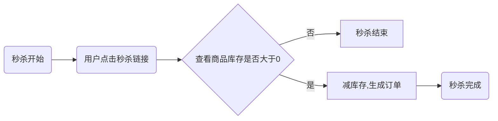

# springboot整合redis和kafka,分析并实现高并发秒杀业务

> 谈谈我理解的秒杀业务。
>我所理解的秒杀业务，就是在某个时间点开启的数量有限的商品促销活动。在这个时间点，会有大量用户请求促销商品的数据，但只有有限数量的用户能够成功完成下单的操作。这是一个互联网电商中比较典型的业务场景。
> 
>协议：CC BY-SA 4.0 https://creativecommons.org/licenses/by-sa/4.0/  
> 
>版权声明：本文为原创文章，遵循 CC 4.0 BY-SA 版权协议，转载请附上原文出处链接及本声明。


## 一、秒杀业务分析




------

针对秒杀场景的理解进行一个业务分析：

1. 短时间大数据量用户的访问，服务器将处于一个高负载的状态，会增加响应时间，甚至过高的并发的会导致服务器的崩溃
2. 短时间大量请求同时请求数据库的数据，mysql读数据大概5k/s，性能不足
3. 有限的库存，不能存在超卖即卖出商品的数量大于库存。

## 二、解决方案

#### 2.1 拦截部分请求

针对前端来讲，在点击后可以将按钮置为不可点，防止同一个请求发送多次
针对同一个ip地址，限制访问次数
接入风控系统，在用户发起秒杀请求后，先通过风控或者黑名单进行过滤
如果拦截部分请求后，流量依然很大，可以通过消息队列进行削峰。先将用户请求放到消息队列中，然后从消息队列中消费并进行秒杀处理。

#### 2.2 引入缓存

常用的mysql数据库，读数据大概在5k/s。针对秒杀业务场景，典型的读多写少，短时间内大量查询的请求，mysql数据库的性能远远不足，因此可以引入redis等缓存数据库。
目前使用比较多的redis，单节点的读写分别可以达到10w/s和5w/s。读写性能优于mysql数据库。可以在秒杀前提前将秒杀商品的数据预热到redis缓存中，获取商品数据及减库存操作可以基于redis缓存进行。

#### 2.3 超卖问题

为什么会出现超卖问题？
这是因为查询库存和减库存不是原子性操作。比如在秒杀的最后，还剩余一个库存时，A用户查询到库存大于0，因此可以进行下单，后台会进行减库存操作。在后台减库存但最新的库存信息还未写入到数据库时，另外一个用户B过来也查询到还有一个库存，因此也可以进行下单操作，B下单后，A用户订单完成，库存此时减为0，B的下单操作做会使得库存变为-1。此时就出现了超卖现象。

接下来，就通过代码来简单实现秒杀逻辑，并进行逐步优化。

## 三、秒杀逻辑简单实现及优化

#### 3.1项目搭建

1.创建springboot项目

2.引入依赖

```xml
	<properties>
        <project.build.sourceEncoding>UTF-8</project.build.sourceEncoding>
        <maven.compiler.source>1.8</maven.compiler.source>
        <maven.compiler.target>1.8</maven.compiler.target>

        <lombok.version>1.18.10</lombok.version>
    </properties>

    <dependencies>
        <dependency>
            <groupId>org.springframework.boot</groupId>
            <artifactId>spring-boot-starter-web</artifactId>
        </dependency>
        <!--kafka依赖-->
        <dependency>
            <groupId>org.springframework.kafka</groupId>
            <artifactId>spring-kafka</artifactId>
        </dependency>
        <!--mysql驱动-->
        <dependency>
            <groupId>mysql</groupId>
            <artifactId>mysql-connector-java</artifactId>
            <version>5.1.46</version>
        </dependency>
        <!--redis依赖-->
        <dependency>
            <groupId>org.springframework.boot</groupId>
            <artifactId>spring-boot-starter-data-redis</artifactId>
        </dependency>
        <!--mybatis依赖-->
        <dependency>
            <groupId>org.mybatis.spring.boot</groupId>
            <artifactId>mybatis-spring-boot-starter</artifactId>
            <version>2.1.1</version>
        </dependency>
        <!--lombok依赖-->
        <dependency>
            <groupId>org.projectlombok</groupId>
            <artifactId>lombok</artifactId>
            <version>${lombok.version}</version>
        </dependency>
    </dependencies>
```

3.配置application.yml整合kafka和redis

```yaml
server:
  port: 8889

spring:
  datasource:
    url: jdbc:mysql://ip:3306/seckill?useUnicode=true&characterEncoding=utf-8&useSSL=false
    username: root
    password: root
    driver-class-name: com.mysql.jdbc.Driver
  redis:
    host: ip
    port: 6379
    password: root
  kafka:
    bootstrap-servers: ip:9092,ip:9093

```

4.在mybatis创建数据库seckill、订单表order及商品表product其中pid为商品id，uid为用户id，stock商品库存

```mysql
CREATE TABLE `order`  (
  `id` bigint(20) NOT NULL AUTO_INCREMENT,
  `pid` bigint(20) NOT NULL,
  `uid` bigint(20) NOT NULL,
  PRIMARY KEY (`id`) USING BTREE
) ENGINE = InnoDB AUTO_INCREMENT = 1 CHARACTER SET = utf8mb4 COLLATE = utf8mb4_general_ci ROW_FORMAT = Dynamic;

CREATE TABLE `product`  (
  `id` bigint(20) NOT NULL AUTO_INCREMENT,
  `name` varchar(50) CHARACTER SET utf8mb4 COLLATE utf8mb4_general_ci NOT NULL,
  `stock` int(11) NULL DEFAULT NULL,
  PRIMARY KEY (`id`) USING BTREE
) ENGINE = InnoDB AUTO_INCREMENT = 1 CHARACTER SET = utf8mb4 COLLATE = utf8mb4_general_ci ROW_FORMAT = Dynamic;
```

#### 3.2秒杀代码

##### 3.2.1 创建实体类

创建entity包，并在该包下添加Product商品类和Order订单类

```java
@Data
public class Product {
    private long id;
    private String name;
    private int stock;
}
```

```java
@Data
public class Order {
    private long id;
    private long uid;
    private long pid;
}
```

##### 3.2.2 创建dao

创建dao包，并在该包下创建ProductMapper及OrderMapper，用来操作数据库的product表和order表

```java
public interface OrderMapper {
    /**
     * 生成订单
     *
     * @param order 订单信息
     * @return
     */
    @Insert("insert into `order` (pid,uid) values (#{pid},#{uid})")
    int insertOrder(Order order);
}
```

```java
public interface ProductMapper {
    /**
     * 根据id查询商品信息
     *
     * @param id 商品id
     * @return
     */
    @Select("select * from product where id = #{id}")
    Product selectById(long id);

    /**
     * 商品减库存
     *
     * @param id 商品id
     * @return
     */
    @Update("update product set stock = stock - 1 where id = #{id}")
    int seckillById(long id);
}
```

##### 3.2.3 业务逻辑层

创建service包，新建ProductService和OrderService接口,并在该包下创建impl包,并在impl包下创建ProductServiceImpl及OrderServiceImpl实现类

```java
public interface OrderService {

    int insert(Order order);
}
```

```java
public interface ProductService {

    Product selectById(long id);

    int seckill(long id);
}
```

```java
@Service
public class OrderServiceImpl implements OrderService {
    @Autowired
    private OrderMapper orderMapper;

    @Override
    public int insert(Order order) {
        return orderMapper.insertOrder(order);
    }
}
```

```java
@Service
public class ProductServiceImpl implements ProductService {

    @Autowired
    private ProductMapper productMapper;

    @Override
    public Product selectById(long id) {
        return productMapper.selectById(id);
    }

    @Override
    public int seckill(long id) {
        return productMapper.seckillById(id);
    }
}
```

##### 3.2.4 秒杀接口

创建controller包并添加SeckillController类

```java
@RestController
@RequestMapping("/seckill")
@Slf4j
public class SeckillController {
    @Autowired
    private ProductService productService;
    @Autowired
    private OrderService orderService;
    /**
     * 未引入redis和kafka版实现
     *
     * @param pid 商品id
     * @param uid 用户id
     * @return
     */
    @Transactional
    @GetMapping("/{pid}/{uid}")
    public String seckill(@PathVariable long pid, @PathVariable long uid) {
        //1.从数据库获取商品的库存量
        Product product = productService.selectById(pid);
        int stock = product.getStock();
        //2.判断库存是否足够,足够则进入秒杀
        if (stock > 0) {
            //执行秒杀逻辑
            int result = productService.seckill(pid);
            if (result == 1) {
                //创建订单
                Order order = new Order();
                order.setPid(pid);
                order.setUid(uid);
                orderService.insert(order);
            }
            return result > 0 ? "秒杀成功" : "秒杀失败";
        }
        return "秒杀失败";
    }
}
```

秒杀接口代码逻辑:
1.从数据库获取商品的库存量
2.判断库存是否足够,足够则进入秒杀
2.1减库存
2.2生成订单
目前的实现方式将会出现超卖现象。使用jmeter做并发测试1秒100个请求，测试结果如下：

| id   | name  | stock |
| ---- | ----- | ----- |
| 1    | phone | -7    |

###### 3.2.4.1 数据库层面处理超卖问题

看一下目前减库存的sql语句

```sql
update product set stock = stock - 1 where id = #{id}
```

修改sql语句,加上where stock>0的限制

```sql
update product set stock = stock - 1 where stock > 0 and id = #{id}
```

再进行测试则不会出现超卖的现象。但是此种方案依赖于mysql的数据库的行级锁机制

##### 3.2.4.2 加锁

除了在sql层面解决超卖问题，也可以通过synchronized关键字来解决超卖问题

```java
	@Transactional
	@GetMapping("/{pid}/{uid}")
	public synchronized String seckill(@PathVariable long pid, @PathVariable long uid) {
		//1.从数据库获取商品的库存量
		Product product = productService.selectById(pid);
		int stock = product.getStock();
		//2.判断库存是否足够，足够就进入秒杀
		if (stock > 0) {
			//执行秒杀逻辑
			int result = productService.seckill(pid);
			if (result == 1) {
				//创建订单
				Order order = new Order();
				order.setPid(pid);
				order.setUid(uid);
				orderService.insert(order);
			}
			
			return result > 0 ? "秒杀成功" : "秒杀失败";
		}
		return "秒杀失败";
	}
```

这样可以保证从查询库存到减库存操作的原子性，因此也可以解决超卖问题，但是加锁会导致用户请求串行化，大大降低的系统的吞吐量

##### 3.2.5 秒杀接口优化

此前分析过，mysql数据库读数据大概在5k/s，而redis单机性能可达到读数据10w/s，因此可以将秒杀商品数据预热到redis缓存中
在redis中执行如下命令，添加商品id为1的库存为5（模拟数据预热）

```lua
set seckill:1:stock 5
```

```shell
127.0.0.1:6379> set seckill:1:stock 5
OK
127.0.0.1:6379> get seckill:1:stock
"5"
127.0.0.1:6379>
```


修改SeckillController

```java
@RestController
@RequestMapping("/seckill")
@Slf4j
public class SeckillController {
    @Autowired
    private StringRedisTemplate redisTemplate;
    @Autowired
    private ProductService productService;
    @Autowired
    private OrderService orderService;

    /**
     * 数据预热到redis后的实现
     *
     * @param pid 商品id
     * @param uid 用户id
     * @return
     */
    @GetMapping("/{pid}/{uid}")
    public String seckillWithRedis(@PathVariable long pid, @PathVariable long uid) {
        //返回的decrement为剩余的库存
        Long decrement = redisTemplate.opsForValue().decrement("seckill:" + pid+":stock");
        //剩余库存大于等于0都为秒杀成功
        if (decrement >= 0) {
            //创建订单
            Order order = new Order();
            order.setPid(pid);
            order.setUid(uid);
            orderService.insert(order);
        }
        log.info("decrement:{}", decrement);
        return decrement < 0 ? "秒杀失败" : "秒杀成功";
    }

    /**
     * 未引入redis和kafka版实现
     *
     * @param pid 商品id
     * @param uid 用户id
     * @return
     */
//    @Transactional
//    @GetMapping("/{pid}/{uid}")
//    public synchronized String seckill(@PathVariable long pid, @PathVariable long uid) {
//        //1.从数据库获取商品的库存量
//        Product product = productService.selectById(pid);
//        int stock = product.getStock();
//        //2.判断库存是否足够,足够则进入秒杀
//        if (stock > 0) {
//            //执行秒杀逻辑
//            int result = productService.seckill(pid);
//            if (result == 1) {
//                //创建订单
//                Order order = new Order();
//                order.setPid(pid);
//                order.setUid(uid);
//                orderService.insert(order);
//            }
//            return result > 0 ? "秒杀成功" : "秒杀失败";
//        }
//        return "秒杀失败";
//    }
}

```

redis是单线程的，decrement减库存操作天然就是线程安全的，只要返回值大于等于0即为剩余库存大于等于0，说明秒杀成功，即可进行创建订单操作。
可以通过jmeter测试，使用redis的此种方式性能远强于之前synchronized加锁或者行级锁方式。是否还有可优化空间呢？

秒杀业务短时间内可能有大量用户发起秒杀请求，但是库存数量很小，因此只有最开始一小部分用户可以秒杀成功，后面发过来的多数请求基本都是库存小于0的状态。因此，可以在库存减少为0后，设置该商品的秒杀状态为秒杀结束。

```java
	/**
     * 数据预热到redis后的实现（添加秒杀结束标志）
     *
     * @param pid 商品id
     * @param uid 用户id
     * @return
     */
	@GetMapping("/{pid}/{uid}")
    public String seckillWithRedis(@PathVariable long pid, @PathVariable long uid) {
        String end = redisTemplate.opsForValue().get("seckill:" + pid + ":end");
        if (Objects.equals(end, "1")) {
            return "秒杀结束";
        }
        //返回的decrement为剩余的库存
        Long decrement = redisTemplate.opsForValue().decrement("seckill:" + pid + ":stock");
        //剩余库存大于等于0都为秒杀成功
        if (decrement >= 0) {
            if (decrement == 0) {
                //设置该商品秒杀状态为结束
                redisTemplate.opsForValue().set("seckill:" + pid + ":end", "1");
            }
            //创建订单
            Order order = new Order();
            order.setPid(pid);
            order.setUid(uid);
            orderService.insert(order);
        }
        log.info("decrement:{}", decrement);
        return decrement < 0 ? "秒杀失败" : "秒杀成功";
    }
```


##### 3.2.6 用户不能重复秒杀问题

用户进行秒杀操作，先从redis获取缓存判断该用户是否已经秒杀过，如果未秒杀过，则进行库存判断及减库存操作
用户秒杀成功后，将用户的id存到redis缓存中
此时，又会因为判断用户是否秒杀成功和减库存非原子性操作，出现同一用户多次秒杀成功的问题，可以结合redis引入lua脚本来解决原子性问题。由于redis是单线程的，且lua是redis内置的脚本语言,所以在lua脚本执行过程中不会出现资源抢占，可以保证操作的原子性。

1.编写seckill.lua脚本并放到resources下：

```lua
local product_id = KEYS[1]
local user_id = ARGV[1]
-- 商品库存key
local product_stock_key = 'seckill:' .. product_id .. ':stock'
-- 商品秒杀结束标识的key
local end_product_key = 'seckill:' .. product_id .. ':end'

-- 存储秒杀成功的用户id的集合的key
local bought_users_key = 'seckill:' .. product_id .. ':uids'

--判断该商品是否秒杀结束
local is_end = redis.call('get',product_stock_key)

if  is_end and tonumber(is_end) ~=1 then
    return -1
end
-- 判断用户是否秒杀过
local is_in = redis.call('sismember',bought_users_key,user_id)

if is_in > 0 then
    return 0
end

-- 获取商品当前库存
local stock = redis.call('get',product_stock_key)

-- 如果库存<=0,则返回-1
if not stock or tonumber(stock) <=0 then
    redis.call("set",end_product_key,"1")
    return -1
end

-- 减库存,并且把用户的id添加进已购买用户set里
redis.call("decr",product_stock_key)
redis.call("sadd",bought_users_key,user_id)

return 1
```

2.修改SeckillController

```java
@RestController
@RequestMapping("/seckill")
@Slf4j
public class SeckillController {
    @Autowired
    private StringRedisTemplate redisTemplate;
    @Autowired
    private ProductService productService;
    @Autowired
    private OrderService orderService;

    /**
     * 数据预热到redis后的实现,且使用lua脚本解决用户重复秒杀的问题
     * @param pid
     * @param uid
     * @return
     */
    @GetMapping("/{pid}/{uid}")
    public String seckillWithLua(@PathVariable long pid, @PathVariable long uid) {
        DefaultRedisScript<Long> redisScript = new DefaultRedisScript<>();
        redisScript.setResultType(Long.class);
        redisScript.setScriptSource(new ResourceScriptSource(new ClassPathResource("seckill.lua")));
        Long result = redisTemplate.execute(redisScript, Collections.singletonList(pid + ""), uid + "");
        log.info("result:{}", result);

        if (result == 1) {
            //创建订单
            Order order = new Order();
            order.setPid(pid);
            order.setUid(uid);
            orderService.insert(order);
        }
        return result > 0 ? "秒杀成功" : "秒杀失败";
    }

    /**
     * 数据预热到redis后的实现
     *
     * @param pid 商品id
     * @param uid 用户id
     * @return
     */
//    @GetMapping("/{pid}/{uid}")
//    public String seckillWithRedis(@PathVariable long pid, @PathVariable long uid) {
//        String end = redisTemplate.opsForValue().get("seckill:" + pid + ":end");
//        if (Objects.equals(end, "1")) {
//            return "秒杀结束";
//        }
//        //返回的decrement为剩余的库存
//        Long decrement = redisTemplate.opsForValue().decrement("seckill:" + pid + ":stock");
//        //剩余库存大于等于0都为秒杀成功
//        if (decrement >= 0) {
//            if (decrement == 0) {
//                //设置该商品秒杀状态为结束
//                redisTemplate.opsForValue().set("seckill:" + pid + ":end", "1");
//            }
//            //创建订单
//            Order order = new Order();
//            order.setPid(pid);
//            order.setUid(uid);
//            orderService.insert(order);
//        }
//        log.info("decrement:{}", decrement);
//        return decrement < 0 ? "秒杀失败" : "秒杀成功";
//    }

    /**
     * 未引入redis和kafka版实现
     *
     * @param pid 商品id
     * @param uid 用户id
     * @return
     */
//    @Transactional
//    @GetMapping("/{pid}/{uid}")
//    public synchronized String seckill(@PathVariable long pid, @PathVariable long uid) {
//        //1.从数据库获取商品的库存量
//        Product product = productService.selectById(pid);
//        int stock = product.getStock();
//        //2.判断库存是否足够,足够则进入秒杀
//        if (stock > 0) {
//            //执行秒杀逻辑
//            int result = productService.seckill(pid);
//            if (result == 1) {
//                //创建订单
//                Order order = new Order();
//                order.setPid(pid);
//                order.setUid(uid);
//                orderService.insert(order);
//            }
//            return result > 0 ? "秒杀成功" : "秒杀失败";
//        }
//        return "秒杀失败";
//    }
}
```


##### 3.2.7 秒杀接口订单异步处理优化

上述已经解决了用户重复购买及超卖的问题。减库存成功后，需要进行订单创建。现实场景中，订单的创建可能是一个比较耗时的操作，如果在接口中进行订单的创建，在整个订单创建过程中，请求处于阻塞状态，严重降低系统的吞吐量，因此可以将订单创建放入消息队列中进行异步处理，从而提升系统的吞吐量。
修改SeckillController

```java
@RestController
@RequestMapping("/seckill")
@Slf4j
public class SeckillController {
    @Autowired
    private StringRedisTemplate redisTemplate;
    @Autowired
    private ProductService productService;
    @Autowired
    private OrderService orderService;
    @Autowired
    private KafkaTemplate kafkaTemplate;

    /**
     * 数据预热到redis后的实现,且使用lua脚本解决用户重复秒杀的问题,并引入kafka异步处理订单
     * 
     * @param pid
     * @param uid
     * @return
     */
    @GetMapping("/{pid}/{uid}")
    public String seckillWithLua(@PathVariable long pid, @PathVariable long uid) {
        DefaultRedisScript<Long> redisScript = new DefaultRedisScript<>();
        redisScript.setResultType(Long.class);
        redisScript.setScriptSource(new ResourceScriptSource(new ClassPathResource("test.lua")));
        Long result = redisTemplate.execute(redisScript, Collections.singletonList(pid + ""), uid + "");
        log.info("result:{}", result);

        if (result == 1) {
            //创建订单
            Order order = new Order();
            order.setPid(pid);
            order.setUid(uid);
            //将创建订单的消息放入kafka消息队列
            kafkaTemplate.send("seckill", JSONUtil.objToString(order));
        }
        return result > 0 ? "秒杀成功" : "秒杀失败";
    }

	//kafka消费者
    @KafkaListener(topics = "seckill", groupId = "g1")
    public void consumer(ConsumerRecord<?, String> record) {
        String value = record.value();
        //字符串转对象
        Order order = JSONUtil.stringToObj(value, Order.class);
        
        orderService.insert(order);
    }

    /**
     * 数据预热到redis后的实现
     *
     * @param pid 商品id
     * @param uid 用户id
     * @return
     */
//    @GetMapping("/{pid}/{uid}")
//    public String seckillWithRedis(@PathVariable long pid, @PathVariable long uid) {
//        String end = redisTemplate.opsForValue().get("seckill:" + pid + ":end");
//        if (Objects.equals(end, "1")) {
//            return "秒杀结束";
//        }
//        //返回的decrement为剩余的库存
//        Long decrement = redisTemplate.opsForValue().decrement("seckill:" + pid + ":stock");
//        //剩余库存大于等于0都为秒杀成功
//        if (decrement >= 0) {
//            if (decrement == 0) {
//                //设置该商品秒杀状态为结束
//                redisTemplate.opsForValue().set("seckill:" + pid + ":end", "1");
//            }
//            //创建订单
//            Order order = new Order();
//            order.setPid(pid);
//            order.setUid(uid);
//            orderService.insert(order);
//        }
//        log.info("decrement:{}", decrement);
//        return decrement < 0 ? "秒杀失败" : "秒杀成功";
//    }

    /**
     * 未引入redis和kafka版实现
     *
     * @param pid 商品id
     * @param uid 用户id
     * @return
     */
//    @Transactional
//    @GetMapping("/{pid}/{uid}")
//    public synchronized String seckill(@PathVariable long pid, @PathVariable long uid) {
//        //1.从数据库获取商品的库存量
//        Product product = productService.selectById(pid);
//        int stock = product.getStock();
//        //2.判断库存是否足够,足够则进入秒杀
//        if (stock > 0) {
//            //执行秒杀逻辑
//            int result = productService.seckill(pid);
//            if (result == 1) {
//                //创建订单
//                Order order = new Order();
//                order.setPid(pid);
//                order.setUid(uid);
//                orderService.insert(order);
//            }
//            return result > 0 ? "秒杀成功" : "秒杀失败";
//        }
//        return "秒杀失败";
//    }
}
```

至此，秒杀相关的超卖、用户重复秒杀、订单异步处理已经做了简单的实现~

## 5.总结

针对秒杀：

1. 消息队列：削峰、订单等耗时操作的异步处理等
2. redis：热点数据（秒杀商品）的提前预热，lua脚本实现判断用户是否重复秒杀及减库存一系列操作的原子性等


参考文档(

[https://blog.csdn.net/qq_37641047/article/details/105823008]: https://blog.csdn.net/qq_37641047/article/details/105823008

)

=====================================================================

微信公众号：

